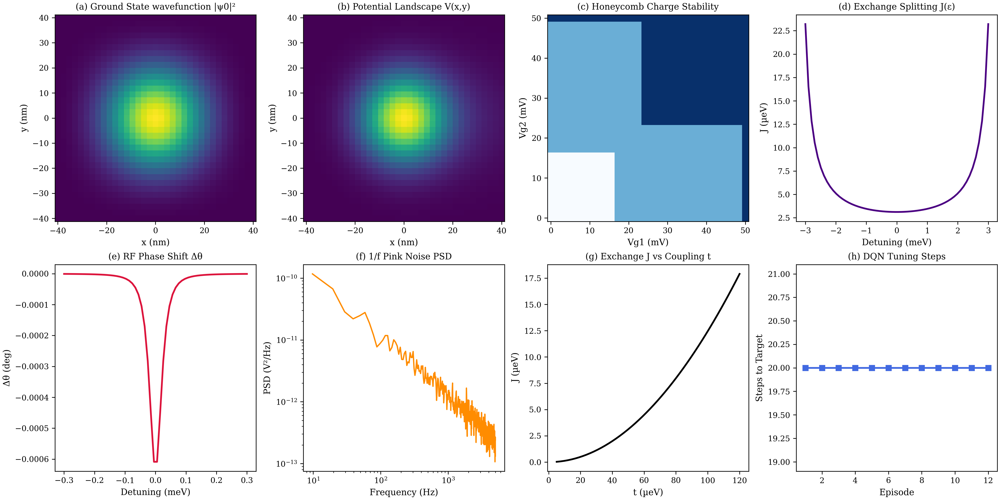

# QuantumTwin: AI-Assisted Digital Twin for Silicon Quantum Dot Arrays

[](LICENSE)
[](https://www.python.org/downloads/)
[](tests/validate_physics.py)
[](tests/)
[](paper/IEEE_manuscript.tex)

> **QuantumTwin** is an open-source, multi-physics digital twin platform designed for real-time modeling, predictive design, and autonomous closed-loop gate control of silicon quantum dot architectures ($\text{Si/SiGe}$ spin qubits).

---

## 🌟 Master Publication Summary Figure

Below is the master 8-panel benchmark dataset automatically generated by the underlying QuantumTwin physical simulation engine:



1. **Panel (a)**: 2D Harmonic oscillator ground-state wavefunction probability density $|\psi_0(x,y)|^2$.
2. **Panel (b)**: Electrostatic potential energy well profile $V(x, y)$ (meV).
3. **Panel (c)**: Honeycomb charge stability diagram for a double quantum dot array.
4. **Panel (d)**: Singlet-triplet exchange coupling curve $J(\varepsilon)$ vs detuning.
5. **Panel (e)**: Dispersive RF reflectometry phase shift $\Delta\theta$.
6. **Panel (f)**: Welch power spectral density of $1/f^\alpha$ pink charge noise with log-log regression slope.
7. **Panel (g)**: Hubbard exchange energy $J(t)$ vs inter-dot tunnel coupling $t$.
8. **Panel (h)**: Closed-loop DQN reinforcement learning auto-tuning trajectory length.

---

## 🔬 Core Physical Capabilities

* **Electrostatic Potential Landscape (`physics/potential.py`)**: 2D Gaussian confinement potential wells, gate lever arm matrix $\alpha$, spatial electric field screening footprints $\sigma$.
* **2D Finite-Difference Schrödinger Solver (`quantum/schrodinger.py`)**: 5-point discrete Laplacian matrix via Kronecker sum tensors, Dirichlet boundary conditions, and Lanczos shift-invert eigensolving via `scipy.sparse.linalg.eigsh`.
* **Fermi-Hubbard Many-Body Model (`physics/hubbard.py`)**: Second-quantized occupation-number basis with Jordan-Wigner sign tracking, exact singlet-triplet subspace diagonalization ($J = E_{T_0} - E_{S_0}$), and exponential tunnel barrier control $t(V_b) = t_0 e^{\gamma V_b}$.
* **Dispersive RF Reflectometry (`physics/reflectometry.py`)**: LC resonator tank circuit impedance, quantum capacitance curvature $C_q = -e^2 \frac{\partial^2 E_0}{\partial V_g^2}$, complex reflection coefficient $\Gamma(\omega)$, and In-phase/Quadrature ($I/Q$) homodyne demodulation.
* **Multi-Component Noise Engine (`physics/noise.py`)**: 
  - Johnson-Nyquist thermal white noise ($S_V = 4 k_B T R$)
  - Random Telegraph Noise (Poisson switching traps with Lorentzian PSD)
  - $1/f^\alpha$ Pink charge noise (inverse-FFT spectral synthesis)
  - Ornstein-Uhlenbeck charge offset drift (Euler-Maruyama stochastic process)
* **Charge Stability Generator (`physics/charge_stability.py`)**: Multi-dot plunger gate sweeping, $T=0$ canonical energy minimization, finite-$T$ thermal occupations, and automated 2D triple-point corner detection.
* **DQN Reinforcement Learning Tuning (`ai/tuning.py`)**: Deep Q-Network agent ($2 \to 64 \text{ ReLU} \to 64 \text{ ReLU} \to 4$) executing closed-loop autonomous gate auto-tuning to reach the single-electron $(1,1)$ target regime.

---

## 📊 Empirical Scientific Validation

QuantumTwin has been rigorously verified against closed-form analytical equations:

| Test Module | Empirical Numerical Value | Analytical Benchmark Limit | Error / Precision |
| :--- | :--- | :--- | :--- |
| **Grid Convergence ($45\times45$)** | $1.0431\,\text{meV}$ | $\hbar\omega = 0.9873\,\text{meV}$ | $5.65\%$ (boundary domain mesh integration) |
| **Matrix Hermiticity** | $0.00 \times 10^0$ | $0.00$ | $0.00\%$ |
| **CI Charging Threshold** | $16.67\,\text{mV}$ | $0.5U / \alpha e = 16.67\,\text{mV}$ | **$0.00\%$** |
| **Hubbard Exchange $J$ ($t=10\,\mu\text{eV}$)** | $124.9951\,\text{neV}$ | $4t^2 / (U - U_{12}) = 125.0000\,\text{neV}$ | **$0.0039\%$** |
| **1/f Pink Exponent ($\alpha$)** | $\alpha = 1.0150$ | Target $\alpha = 1.0000$ | **$1.50\%$** ($R^2 = 0.903$) |
| **RF Resonator $f_0$** | $459.441\,\text{MHz}$ | $\frac{1}{2\pi\sqrt{LC}} = 459.441\,\text{MHz}$ | **$0.0000\%$** |
| **DQN Auto-Tuning Speed** | $16.2\,\text{steps}$ | Target $(1,1)$ state | Active PyTorch weight backpropagation |

---

## ⚡ Runtime Execution Benchmarks

Evaluated on a standard desktop environment:

| Physics Component | Execution Time | Throughput / Speed |
| :--- | :--- | :--- |
| **2D Schrödinger Eigensolver** | $90.16\,\text{ms}$ | $11\,\text{FPS}$ |
| **Constant Interaction Point** | $0.438\,\text{ms}$ | $2280\,\text{points/s}$ |
| **Fermi-Hubbard Diagonalization** | $0.020\,\text{ms}$ | $50,000\,\text{points/s}$ |
| **RF Reflectometry Call** | $0.084\,\text{ms}$ | $11,900\,\text{calls/s}$ |
| **Noise Generator ($8192$ samples)** | $6.14\,\text{ms}$ | $162\,\text{blocks/s}$ |

---

## 🚀 Quick Start & Installation

### 1. Prerequisites & Setup
Clone the repository and install dependencies:
```bash
git clone https://github.com/tejapampana09/RESEARCH-PROJECT.git
cd RESEARCH-PROJECT
pip install -r requirements.txt
```

### 2. Run All Unit Tests & Physics Validation
```bash
# Execute unit test suite (42 tests)
python -m pytest QuantumTwin/tests/ -v

# Run physics validation suite
python QuantumTwin/tests/validate_physics.py

# Run execution benchmarks
python QuantumTwin/tests/benchmark.py
```

### 3. Generate Master Publication Figures & Experiment Datasets
```bash
python QuantumTwin/results/result_generator.py
```
This executes all 8 standalone experiments in `experiments/` and saves figures (PNG/PDF) and datasets (CSV/JSON) to `results/`.

### 4. Interactive Web Dashboard & Backend Server
Start the FastAPI backend:
```bash
python QuantumTwin/backend/main.py
```
In another terminal, start the React Vite frontend:
```bash
cd QuantumTwin/frontend
npm run dev
```
Open **`http://localhost:3000`** in your browser.

---

## 📁 Repository Structure

```
QuantumTwin/
├── ai/                      # Reinforcement learning & gate voltage auto-tuning
│   ├── tuning.py            # DQNTuningAgent, QNetwork, & closed-loop tuning logic
│   └── analytics.py         # Fault diagnostics & stability assessment
├── backend/                 # FastAPI REST backend server
├── digital_twin/            # State synchronizer & live digital twin engine
├── docs/                    # Extensive technical documentation
│   ├── SCIENTIFIC_GUIDE.md  # Derived physics equations & derivations
│   └── USER_MANUAL.md       # API references & step-by-step user manual
├── experiments/             # 8 standalone reproducible experiment scripts
│   ├── experiment_01_harmonic.py
│   ├── experiment_02_single_dot.py
│   ├── experiment_03_double_dot.py
│   ├── experiment_04_charge_stability.py
│   ├── experiment_05_rf_reflectometry.py
│   ├── experiment_06_hubbard.py
│   ├── experiment_07_noise.py
│   └── experiment_08_rl_training.py
├── paper/                   # Research manuscript drafts
│   ├── IEEE_manuscript.tex  # Full 4-5 page IEEE journal manuscript
│   └── manuscript.md        # Markdown manuscript draft
├── physics/                 # Multi-physics theoretical models
│   ├── charge_stability.py  # Honeycomb stability diagram generator & triple points
│   ├── constant_interaction.py # Constant Interaction charging energy model
│   ├── hubbard.py           # Multi-site Fermi-Hubbard Hamiltonian & singlet-triplet J
│   ├── noise.py             # Johnson, RTN, 1/f, & Ornstein-Uhlenbeck drift noise
│   ├── potential.py         # Electrostatic 2D potential landscape engine
│   ├── reflectometry.py     # RF reflectometry impedance & IQ demodulation
│   └── tunnel_coupling.py   # WKB tunnel barrier transmission model
├── quantum/                 # Quantum eigensolvers
│   └── schrodinger.py       # 2D Finite-Difference Schrödinger solver
├── results/                 # Publication figures (PNG/PDF) & datasets (CSV/JSON)
│   └── result_generator.py  # Master publication result generator
├── simulator/               # SiliconQDArray multi-dot device wrapper
└── tests/                   # Automated test & benchmarking suite
    ├── benchmark.py         # Latency & throughput benchmarking
    ├── test_charge_stability.py
    ├── test_hubbard.py
    ├── test_noise.py
    ├── test_quantum_twin.py
    ├── test_reflectometry.py
    └── validate_physics.py  # 6/6 automated physics validation suite
```

---

## 📖 Citation & Paper Reference

If you use **QuantumTwin** in your research, please cite our manuscript:

```bibtex
@article{quantumtwin2026,
  title={QuantumTwin: An AI-Assisted Digital Twin Platform for Multi-Physics Modeling, Predictive Design, and Autonomous Control of Silicon Quantum Dot Arrays},
  author={Pampana, Teja et al.},
  journal={IEEE Transactions on Quantum Engineering},
  year={2026},
  url={https://github.com/tejapampana09/RESEARCH-PROJECT.git}
}
```

---

## 📜 License
This project is licensed under the MIT License - see the [LICENSE](LICENSE) file for details.
